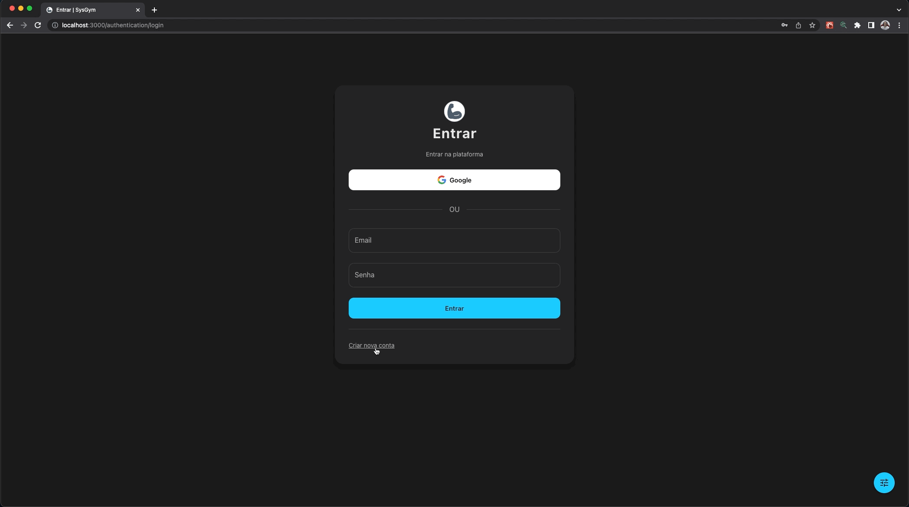
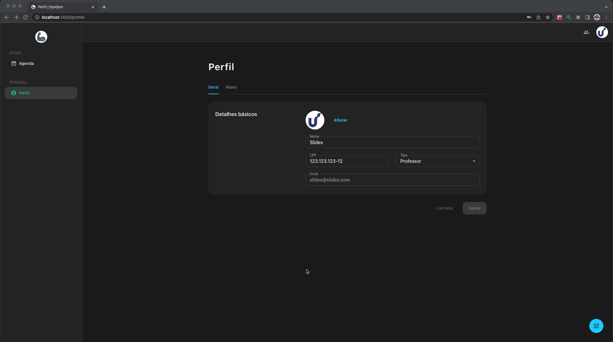
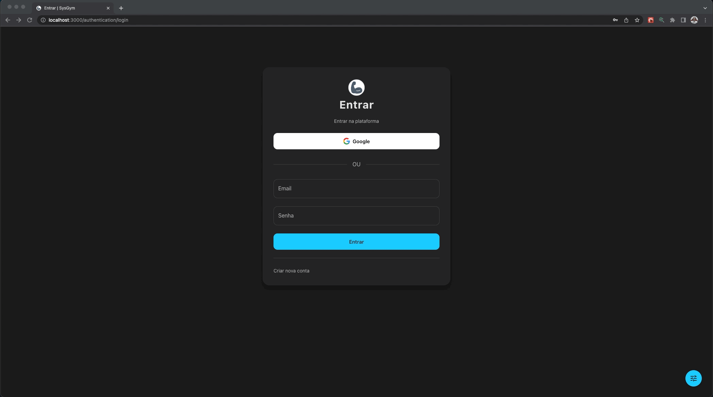

## 💻 Projeto

Projeto desenvolvido para as cadeiras de Desenvolvimento de Software III e Arquitetura de Software, da graduação de Ciência da Computação da Unisinos. Consiste no desenvolvimento de uma aplicação de um sistema de academia, o qual foi desenvolvido após uma vasta construção de artefatos teóricos como diagrama e especificações de casos de uso, personas, jornadas e histórias de usuário, arquitetura em camadas e diagrama de componentes, implantação, classes e sequência.

## 🚀 Tecnologias utilizadas

- [Next.js](https://nextjs.org/)
- [TypeScript](https://www.typescriptlang.org/)
- [MUI](https://mui.com/)
- [Formik](https://formik.org/)
- [FullCalendar](https://fullcalendar.io/)
- [Firebase](https://firebase.google.com/)
  - [Authentication](https://firebase.google.com/docs/auth)
  - [Storage](https://firebase.google.com/docs/storage)
  - [Cloud Firestore](https://firebase.google.com/docs/firestore)

<p align="center">
  
  
  
  
</p>

## ⚙ Execução

```bash
# instalar as dependências
yarn
# executar a aplicação
yarn dev
```

Possível acessar a aplicação também pelo deploy feito na [Vercel](https://vercel.com), pois o projeto foi desenvolvido em [Next.js](https://nextjs.org/): [sysgym.vercel.app](https://sysgym.vercel.app/)
